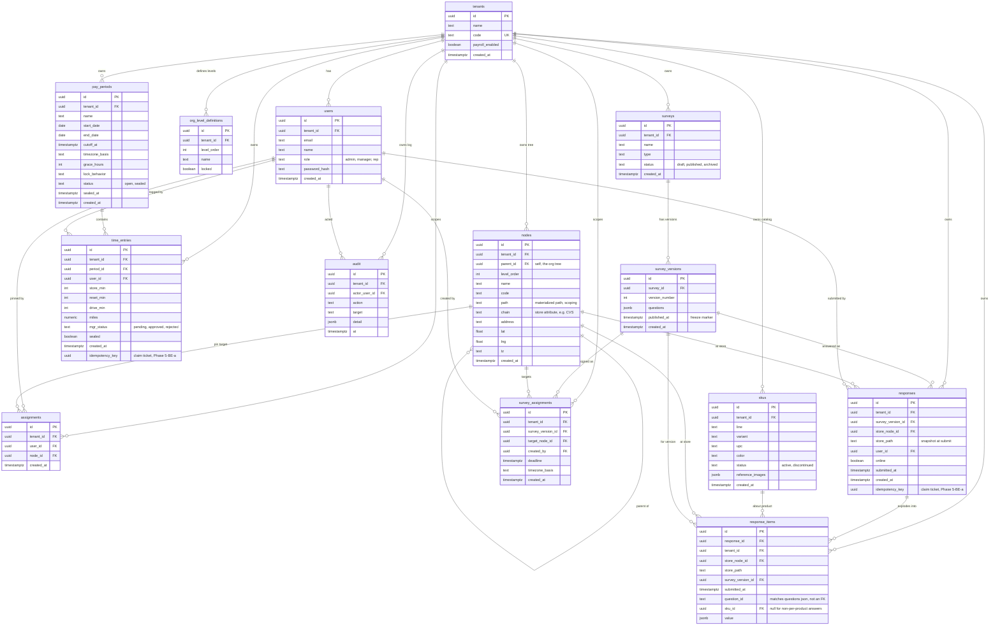

# Intelli database ERD (entity-relationship diagram)

This is the shape of the whole Intelli database, generated from `db/schema.sql`
(the auto-generated snapshot of the live database). It shows every table, its
columns, and the foreign-key links between them.

How to view it:
- On GitHub, this diagram renders automatically.
- In VS Code, open this file and use the Markdown preview (the Mermaid diagram
  renders inline; install a Mermaid preview extension if it does not).
- To share with the Atlanta team, send them this file, or paste the diagram block
  into any Mermaid viewer (for example mermaid.live). No database login needed.

Last regenerated: 2026-06-18, after Phase 5-BE-a (the `idempotency_key` columns).

## How to read it (plain terms)

- **`tenants` is the root of everything.** Every company's data carries a
  `tenant_id`, so almost every table links back to `tenants`. That hub is the
  multi-tenant design: one company never sees another's rows.
- **`nodes` points at itself** (`parent_id`). That is the org tree: a region
  contains districts, a district contains stores, and so on, to any depth.
- **`users` are pinned by `assignments`** to one `node`. That pin, plus the
  `nodes.path` column, is the "scope follows the pin" security boundary (a manager
  sees only their branch).
- **Surveys freeze into versions.** A `survey` has `survey_versions`; once a
  version is published it never changes; results (`responses`) always point at the
  exact version they were answered under.
- **A `response` explodes into `response_items`.** One survey submission becomes
  many atomic rows, one per product per question. That is what powers the per-SKU
  analytics. Pass/fail is computed live from the version's rules and is never
  stored.
- **Payroll:** a `pay_period` contains `time_entries` (one per rep per period),
  and `audit` is the permanent logbook of sensitive actions.

## Two relationships that are NOT drawn as connector lines (by design)

- **The org-tree scoping** uses the `nodes.path` text column (a materialized path
  like `/region/district/store/`), not a foreign key, so it is fast to query
  "everything under X". The diagram shows the `parent_id` self-link; the path is
  the same tree expressed for speed.
- **`response_items.question_id` is text**, matching an id inside the version's
  `questions` JSON, not a foreign key to a questions table (questions live as JSON
  on the version). So there is no connector line for it.

One more table exists that is not shown: `schema_migrations`, which is internal
bookkeeping for the migration tool (dbmate), not part of the data model.

## Keeping this current

This diagram is generated by hand from `db/schema.sql`. Whenever a migration
changes the database shape, regenerate `db/schema.sql` (it happens automatically
on `docker compose run --rm migrate up`) and update this diagram to match. A
database viewer like DBeaver can also auto-draw this same picture from a live
connection (see DEPLOY.md section 4 for how Atlanta connects).
